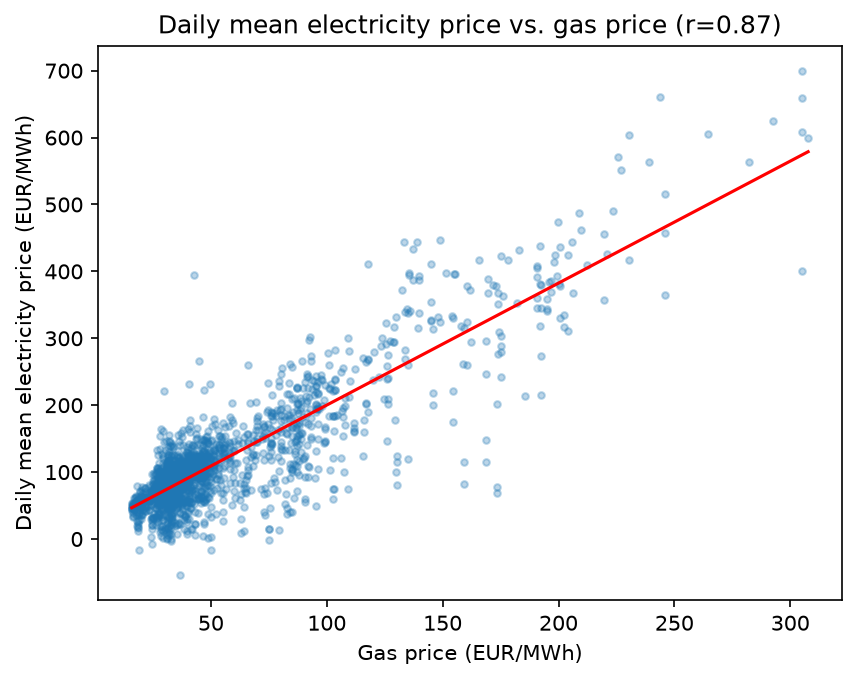
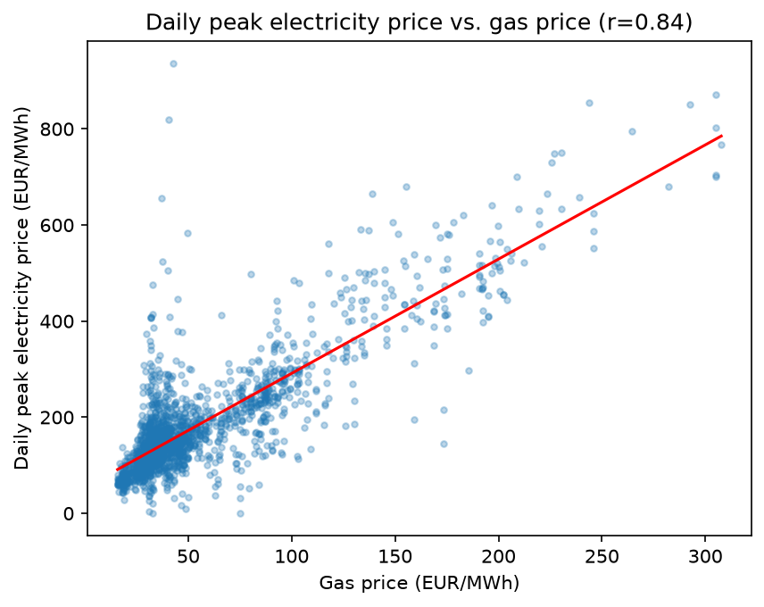
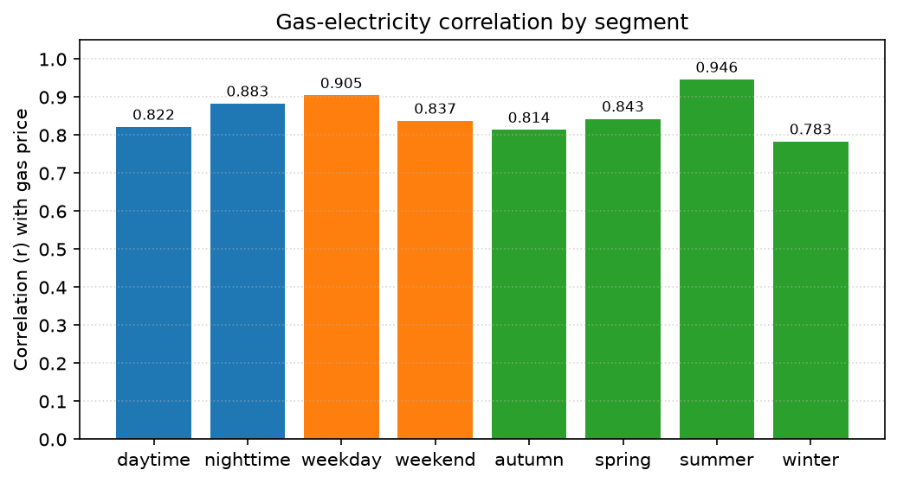
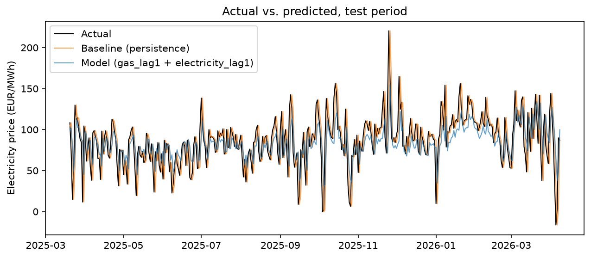
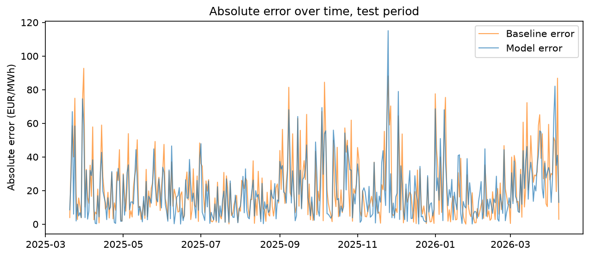

# Analysis: TTF gas price vs. German electricity price

## Part 1: does gas price track electricity price?

**Decision.** Framed as if delivered to an energy trading/risk desk: is TTF gas price a reliable leading indicator for German day-ahead electricity price exposure, and under what conditions should that signal be trusted more or less?

**North Star metrics.**

1. **Correlation strength** - how tightly does gas price move with electricity price?
2. **Reliability by condition** - does that relationship hold evenly across weekday/weekend and season, or does confidence need to vary?
3. **Magnitude** - how much does electricity price move per unit of gas price change?

### Recommendation

1. **Trust the gas-price signal at full weight for weekday and summer exposure; apply a wider margin for weekends and winter.** Weekday correlation (r=0.905) is meaningfully stronger than weekend (r=0.837) - checked directly and confirmed this isn't a data-staleness artifact (see Evidence, below). Summer (r=0.946) is stronger than winter (r=0.783). For a desk calibrating hedge ratios or position sizing off this indicator.
2. **Don't use gas price alone for peak/extreme-price risk - pair it with a volatility or demand-spike indicator.** Gas explains average electricity pricing better than price peaks (mean r=0.874 vs. peak r=0.837), and the same pattern holds by hour (nighttime r=0.883 vs. daytime r=0.822) - the driver is extremeness, not time-of-day. For a desk building tail-risk/VaR models, where over-trusting this indicator would fail worst.
3. **Investigate why winter specifically weakens the relationship before extending this indicator to winter risk models.** Not yet actionable - this is the next analysis, not a confident recommendation. Plausible cause: winter introduces electricity-price volatility (cold-snap demand, wind-generation swings) that a single-variable linear fit can't capture. For whoever owns this indicator's methodology, before it's relied on in Q4/Q1 risk cycles.

### Evidence

**The baseline relationship holds, and holds tightly.** Daily gas price (TTF, ACER/ICIS) correlates strongly with both mean (r=0.874, R²=0.764) and peak (r=0.837, R²=0.701) daily German electricity price, across 1,924 days from 2021 to 2026. This is consistent with Germany's merit-order power market, where gas plants are frequently the marginal, most expensive generator dispatched - gas price often directly sets the electricity clearing price. Correlation alone says nothing about causation, and no other driver of electricity price (demand, renewable output, carbon price) is controlled for here - that caveat applies to every finding below.

**The relationship is tighter on weekdays than weekends.** Weekday r=0.905 (n=1,374) vs. weekend r=0.837 (n=550). Because TTF gas doesn't trade weekends (Saturday/Sunday carry Friday's price forward), a real methodological risk here is that the weekend gap is a join artifact - restricted gas-price variation on weekends mechanically depressing the correlation - rather than a genuine economic difference. Staling weekday gas price by one day (mimicking mild staleness) barely moved weekday r (0.905 → 0.909) - the opposite of what an artifact explanation predicts. Plausible real mechanism: weekday electricity demand is more industrial/predictable, weekend demand shifts toward residential and is more variable, diluting the gas signal.

**The relationship is strongest in summer, weakest in winter - the opposite of what was expected going in.** A stated hypothesis (heating-driven gas demand should make winter the strongest season) was checked directly against the data and falsified: summer r=0.946, winter r=0.783, with spring (0.843) and autumn (0.814) between. Plausible explanation, not yet confirmed: winter likely introduces electricity-price volatility from sources other than gas - cold-snap demand spikes, wind-generation swings - that a single-variable fit can't capture even though gas still matters. This is the open thread behind Recommendation 3.

**Peak prices are noisier than average prices.** Mean electricity correlates more tightly with gas than peak electricity does (0.874 vs. 0.837). The same shape shows up again by hour: nighttime (r=0.883) beats daytime (r=0.822) - the opposite of what "daytime is noisier" would predict. Read together, the sharper explanation is that a single extreme value (a demand spike, a curtailment event) carries more idiosyncratic noise than an averaged window, independent of when in the day or week it happens. This is the basis for Recommendation 2.

## Part 2: can gas price forecast tomorrow's electricity price?

**Decision.** For the same hypothetical desk: given today's gas price, does a simple model predict tomorrow's electricity price well enough to beat just assuming "tomorrow looks like today"? If not, that naive assumption is the better tool.

**North Star metrics.**

1. **Prediction accuracy** - MAE/RMSE, model vs. naive baseline, on a held-out period never seen while fitting.
2. **Improvement magnitude** - in EUR/MWh, not just percent.
3. **Reliability by condition** - does any edge over baseline hold evenly across weekday/weekend and season, or is it concentrated in a few days.

### Recommendation

1. **Use gas price as an additional input alongside yesterday's price, not as a replacement for it.** Gas alone (lagged 1, 3, or 7 days) loses to the naive baseline - correlating with electricity price is a different question from beating a baseline that already knows yesterday's actual price. Combined with yesterday's price, the model wins clearly. For a desk deciding whether gas data is worth ingesting into a forecasting pipeline at all: yes, but as a supplement to price momentum, not a standalone signal.
2. **Trust this model on weekdays and in spring/summer/autumn; expect no real edge on weekends or in winter.** The improvement holds broadly but disappears on weekends and turns small and mixed in winter. Both exceptions match findings already established above, not new gaps: weekend gas prices are known carry-forward values with less fresh signal, and winter already showed the weakest gas-electricity correlation of any season. For a desk deciding when to lean on this model versus fall back to a simpler assumption.
3. **This is a simple linear regression, not a machine-learning system** - the same line-fitting technique used above, extended to lagged, multiple predictors and checked out-of-sample. No cross-validation, hyperparameter search, or model comparison beyond the two feature sets shown below. Appropriate scope for the question being asked; a reader expecting a production forecasting system should look elsewhere.

### Evidence

**Gas alone is not enough to beat persistence.** A model using only lagged gas price (1, 3, and 7 days back) scored notably worse than the naive baseline, regardless of whether one lag or three were used - ruling out an unstable multi-predictor fit as the explanation. Gas correlating with electricity is a different question from gas beating a baseline that already sees yesterday's real price; the baseline is a genuinely strong reference point, not a weak strawman.

**Combined with yesterday's price, gas adds real, positive signal.** Fitting on gas's most recent price together with yesterday's electricity price: a real improvement over baseline on both error measures. Both coefficients are positive and interpretable - price momentum still carries the larger weight, but gas contributes real signal beyond it, not overlapping or redundant with it.

**The improvement is broad, with two explained exceptions.** Checked across weekday/weekend and all four seasons before treating the headline number as the finding: the model improves on weekdays and in spring, summer, and autumn, but is essentially tied with baseline on weekends and shows a small, mixed result in winter. Both exceptions align with findings already established above (weekend gas prices carry Friday's value forward; winter has the weakest gas-electricity correlation of any season) rather than pointing to a new, unexplained failure mode.

**A concrete example of where the model earns its edge.** On a day when electricity price jumped sharply from an unusually low prior-day value, the naive baseline carried the low value forward and missed badly; the model, informed by gas price, missed by roughly half as much - not because it predicted the jump precisely, but because it wasn't anchored purely to a value that had just become stale.

## Methodology, limitations, and scope

**Sources and validation.** TTF gas (ACER/ICIS, daily, 2021-01-01 to 2026-04-08) and German day-ahead electricity (SMARD, hourly, same range) - both checked against independent references (energy-charts.info for electricity, Yahoo `TTF=F` for gas) before any analysis; gas's weekend carry-forward pattern confirmed across 4 separate weekends. Full detail, exact download steps, and known data quirks: [`DATA_SOURCES.md`](DATA_SOURCES.md).

**Leakage check.** Lag features (`gas_lag1/3/7`, `electricity_lag1`) are computed with a backward-only shift, so each row's features depend only on that row's own earlier dates - never on a later row, and never on the row's own target value. The train/test split happens after this step and is purely chronological (no shuffling): the model is fit only on rows before the split date and evaluated only on rows after it, so no test-period value - feature or target - is ever seen during fitting. No summary statistic (a mean, a scaler) was computed across the full dataset and reused across the split, which is the more common, subtler leakage route than the split itself.

**Limitations.** Correlation, not causation - demand, renewable output, and carbon price are unaccounted for. Gas is a futures/day-ahead assessment, not a perfect proxy for real-time spot price (a small, consistent gap against Yahoo's futures close confirms this, rather than being a red flag). Weekend gas prices are carried forward, not real settlement values - a documented source limitation, checked and found not to explain the weekday/weekend finding above. The prediction model is evaluated on a single chronological train/test split, not walk-forward or rolling validation - appropriate for the scope of the question here, but the reported numbers reflect one specific test window, not an average across many.
